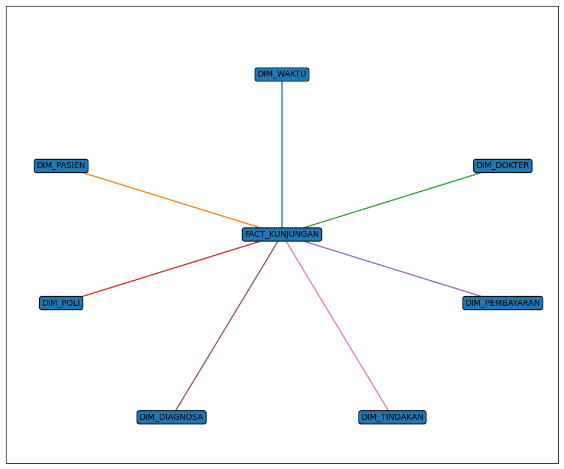

# Hospital Data Warehouse (PostgreSQL – Star Schema)

## 1.  Project Overview

Project ini merupakan implementasi **Data Warehouse Rumah Sakit** menggunakan **PostgreSQL** dengan pendekatan **Star Schema**.

Tujuan utama project ini adalah membangun database analitik yang dapat digunakan untuk kebutuhan laporan dan Business Intelligence, seperti:

- Total kunjungan pasien per hari / bulan
- Total pendapatan per poli
- Diagnosa paling sering muncul
- Performa dokter berdasarkan jumlah kunjungan
- Perbandingan metode pembayaran (BPJS, Asuransi, Tunai)

---

## 2.  Arsitektur Data Warehouse

Project ini menggunakan model **Star Schema**, yang terdiri dari:

### 2.1 Fact Table
- `fact_kunjungan`


###  2.2 Dimension Tables
- `dim_waktu`
- `dim_pasien`
- `dim_dokter`
- `dim_poli`
- `dim_pembayaran`
- `dim_diagnosa`
- `dim_tindakan`

---

## 3.  Struktur Database

###  3.1 Fact Table

#### `fact_kunjungan`

Berisi data transaksi / kejadian kunjungan pasien.

Kolom utama:
```
- Foreign key ke seluruh dimension table
- Jenis kunjungan (Rawat Jalan / IGD / Rawat Inap)
- Lama rawat
- Status kunjungan
- Biaya konsultasi
- Biaya tindakan
- Biaya obat
- Biaya kamar
- Total biaya (generated column)
```
---

### 🔵 3.2 Dimension Tables
```
| Tabel | Deskripsi |
|-------|------------|
| `dim_waktu` | Informasi tanggal (hari, bulan, tahun, kuartal) |
| `dim_pasien` | Data pasien |
| `dim_dokter` | Data dokter |
| `dim_poli` | Data poli / departemen |
| `dim_pembayaran` | Metode pembayaran |
| `dim_diagnosa` | Kode diagnosa |
| `dim_tindakan` | Data tindakan medis |
```
---

## 4. Contoh Query Analitik

### 4.1 Total Pendapatan per Poli per Bulan

```sql
SELECT 
  w.tahun,
  w.bulan,
  p.nama_poli,
  COUNT(*) AS jumlah_kunjungan,
  SUM(f.total_biaya) AS total_biaya
FROM dw_rs.fact_kunjungan f
JOIN dw_rs.dim_waktu w ON w.waktu_key = f.waktu_key
JOIN dw_rs.dim_poli p ON p.poli_key = f.poli_key
GROUP BY w.tahun, w.bulan, p.nama_poli
ORDER BY total_biaya DESC;
```

### 4.2 Diagnosa Terbanyak

```sql
SELECT 
  d.diagnosa_nama,
  COUNT(*) AS jumlah_kasus
FROM dw_rs.fact_kunjungan f
JOIN dw_rs.dim_diagnosa d ON d.diagnosa_key = f.diagnosa_key
GROUP BY d.diagnosa_nama
ORDER BY jumlah_kasus DESC
LIMIT 10;
```

---

## 5. Teknologi yang Digunakan
- PostgreSQL  
- SQL  
- Data Warehouse Concept  
- Star Schema Modeling
- ChatGPT (digunakan untuk bantuan desain, penyusunan dokumentasi, dan penyempurnaan SQL)

---


---

## 6. 📷 ERD Diagram

Star Schema Diagram:



---

## 8. 🎯 Tujuan Project

Project ini dibuat untuk:

- Latihan membangun Data Warehouse  
- Memahami konsep Fact & Dimension  
- Implementasi Star Schema di PostgreSQL  
